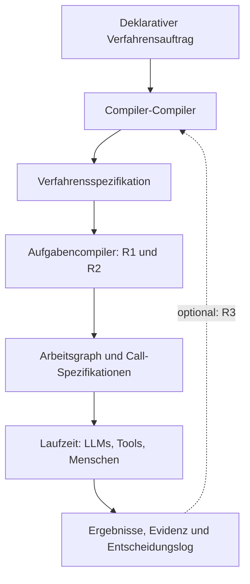
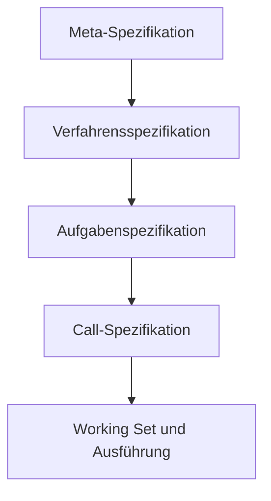

# Der Schnittwerk-Compiler-Compiler

## Eine erzeugende Architektur für epistemische Verfahren, Working Sets und präzise LLM-Aufträge

**Status:** Konzeptpapier 0.1  
**Projekt:** Schnittwerk – Eine epistemische Architektur für Fragen, Perspektiven und Problemräume

---

## Kurzfassung

Der Schnittwerk-Compiler-Compiler ist eine Ebene oberhalb einzelner LLM-Aufrufe. Er beantwortet nicht unmittelbar eine Sachfrage, sondern erzeugt zunächst ein passendes **epistemisches Verfahren**: eine ausführbare Beschreibung dafür, wie die Frage zerlegt, auf welche begriffliche oder operative Basis sie gestellt, welche Informationen für jeden Arbeitsschritt benötigt und wie die Teilergebnisse wieder zusammengesetzt und geprüft werden sollen.

Das System unterscheidet drei Ebenen:

1. Der **Compiler-Compiler** erzeugt oder konfiguriert aus einer deklarativen Verfahrensbeschreibung einen Aufgabencompiler.
2. Der **Aufgabencompiler** übersetzt ein konkretes Problem in einen Arbeitsgraphen aus kleinen, klar spezifizierten Schritten.
3. Die **Laufzeit** führt diese Schritte durch LLMs, Werkzeuge oder Menschen aus und hält Ergebnisse, Quellen, Entscheidungen und Unsicherheiten fest.

Die Analogie zum Compiler ist funktional gemeint: Eine reichhaltige, unscharfe Eingabe wird in eine Folge kleinerer, expliziter und prüfbarer Operationen übersetzt. Der Vorgang bleibt probabilistisch, sobald LLMs beteiligt sind. Entscheidend ist nicht deterministische Textproduktion, sondern eine stabile Übersetzungswirkung: Anforderungen, Invarianten, Abhängigkeiten und Prüfbedingungen sollen über mehrere Verarbeitungsschritte hinweg erhalten bleiben.

Die drei Refactoring-Verfahren von Schnittwerk erhalten darin unterschiedliche Rollen:

- **R1 – Gute Zerlegung** erzeugt eine tragfähige Aufgabenstruktur.
- **R2 – Basisfindung** wählt die für die Aufgabe geeigneten Begriffe, Unterscheidungen, Perspektiven und Operatoren.
- **R3 – Lernen und Metarefactoring** wertet vergangene Ausführungen aus und schlägt Verbesserungen an Verfahren, Zerlegungen und Basen vor.

**R1 und R2 bilden bereits ein vollständiges, sinnvoll nutzbares Kernsystem.** R3 ist eine optionale Lernschicht. Es verbessert das System über mehrere Durchläufe hinweg, ist aber weder Voraussetzung für die Erzeugung guter Arbeitspläne noch für deren kontrollierte Ausführung.

Eine zentrale Operation ist die **Erstellung des Working Sets als eigener LLM-Call**. Ein Arbeits-LLM erhält nicht einfach den gesamten verfügbaren Kontext. Ein vorgeschalteter Aufruf entscheidet gezielt, welche Quellen, Definitionen, Zwischenergebnisse, Instruktionen und offenen Fragen für genau den nächsten Schritt benötigt werden. Dadurch wird Kontext nicht bloß gekürzt, sondern aufgabenbezogen kompiliert.

Der langfristige Gegenstand ist damit kein einzelner Universal-Prompt, sondern ein **Compilergenerator für epistemische Verfahren**: Aus deklarativen Beschreibungen von Erkenntnisaufgaben entstehen spezialisierte, versionierbare und prüfbare Ablaufmaschinen.

---

## 1. Ausgangspunkt

Ein LLM-Aufruf ist eine leistungsfähige, aber grobe Operation. Er kann formulieren, strukturieren, vergleichen, klassifizieren, recherchieren und Schlussfolgerungen vorschlagen. Bei größeren Aufgaben treten jedoch bekannte Probleme auf:

- Der relevante Kontext ist größer als der wirksame Aufmerksamkeitsraum.
- Frühe Instruktionen verlieren im Verlauf an Gewicht.
- Teilaufgaben werden unvollständig oder funktional redundant zerlegt.
- Begriffe und Bewertungskriterien wechseln unbemerkt.
- Entscheidungen erscheinen im Endtext, ohne dass Alternativen und Gründe erhalten bleiben.
- Ein leistungsfähiges Modell kompensiert Verfahrensmängel durch implizites Können; ein kleines Modell kann dies oft nicht.
- Historie wird entweder vergessen oder unkritisch als Präferenz und Gewohnheit fortgeschrieben.

Das Problem lautet daher nicht nur:

> Welches Modell beantwortet die Frage?

Sondern vorher:

> Welches Verfahren soll auf die Frage angewendet werden, welche Teiloperationen braucht es, und welchen Working Set benötigt jede einzelne Operation?

Der Schnittwerk-Compiler-Compiler macht diese vorgeschaltete Ebene explizit.

---

## 2. Leitidee: Epistemische Arbeit als Übersetzung

Eine komplexe Anfrage liegt zunächst in einer für unmittelbare Ausführung ungünstigen Form vor. Sie enthält Ziele, Annahmen, Begriffe, implizite Kriterien, unbekannte Abhängigkeiten und möglicherweise mehrere Aufgaben zugleich. Der Compiler übersetzt sie in eine kontrollierbarere Zwischenform.

Dabei verändert er nicht einfach den Wortlaut. Er erzeugt:

- eine explizite Problemstruktur,
- eine begründete Operatoren- und Begriffsbasis,
- einen Abhängigkeitsgraphen,
- ausführbare Teilspezifikationen,
- Working-Set-Spezifikationen,
- Prüf- und Abbruchbedingungen,
- ein Entscheidungslog,
- Regeln für die spätere Synthese.

Die kleinste ausführbare Einheit ist nicht der Prompt allein, sondern eine **Call-Spezifikation** aus:

- Zweck,
- Eingaben,
- Working Set,
- geltenden Invarianten,
- erlaubten Operationen,
- erwartetem Ausgabeformat,
- Qualitäts- und Abbruchkriterien,
- Provenienzanforderungen.

Ein kleines LLM soll möglichst wenig erraten müssen. Je kleiner oder weniger leistungsfähig das ausführende Modell ist, desto wichtiger werden gute Zerlegung, explizite Begriffe, ein enges Working Set und eine präzise Ergebnissignatur.

---

## 3. Was hier „Compiler“ bedeutet

Der Begriff ist weder bloße Metapher noch die Behauptung, probabilistische Sprachmodelle verhielten sich wie deterministische Übersetzer.

Die Compiler-Analogie bezeichnet vier konkrete Eigenschaften:

1. **Stufenbildung:** Eine Eingabe wird nicht unmittelbar ausgeführt, sondern zunächst in Zwischenrepräsentationen überführt.
2. **Explizite Semantik:** Ziele, Invarianten, Abhängigkeiten und Ergebnistypen werden adressierbar gemacht.
3. **Prüfbarkeit:** Zwischenstände können gelintet, verglichen, verworfen oder erneut kompiliert werden.
4. **Zielanpassung:** Derselbe epistemische Auftrag kann für unterschiedliche Modelle, Werkzeuge, Budgets oder Datenschutzbedingungen verschieden übersetzt werden.

Ein klassischer Compiler übersetzt Quellcode für eine Zielmaschine. Der Schnittwerk-Compiler übersetzt ein Erkenntnisproblem für eine **epistemische Zielumgebung**: bestimmte LLMs, Werkzeuge, Quellen, Menschen, Kosten- und Zeitbudgets.

Der Compiler-Compiler geht eine Ebene höher. Er erzeugt nicht primär Antworten und auch nicht nur Arbeitspläne, sondern **spezialisierte Übersetzer für Klassen von Erkenntnisproblemen**.

---

## 4. Die drei Refactoring-Verfahren

### 4.1 R1 – Gute Zerlegung

R1 übersetzt die Ausgangsaufgabe in Teile, deren Funktionen unterscheidbar, deren Schnittstellen benennbar und deren Ergebnisse wieder zusammensetzbar sind.

Eine gute Zerlegung ist nicht einfach möglichst fein. Sie ist **bezüglich eines Zwecks** gut. Der Compiler muss daher stets festhalten:

- Bezüglich welches Ziels wird zerlegt?
- Welche Teilfunktion erfüllt jeder Schritt?
- Welche Information benötigt er?
- Welches Ergebnis stellt er anderen Schritten bereit?
- Wo bestehen Abhängigkeiten?
- Welche Schritte sind redundant, gekoppelt oder noch zu unscharf?

R1 erzeugt als Ergebnis einen Aufgaben- oder Erkenntnisgraphen. Seine Knoten sind epistemische Operationen; seine Kanten transportieren Ergebnisse, Anforderungen, Evidenz oder offene Fragen.

Typische R1-Operationen sind:

- Zielklärung,
- Begriffsbestimmung,
- Behauptungsextraktion,
- Annahmenprüfung,
- Quellenrecherche,
- Evidenzbewertung,
- Perspektivenvergleich,
- Gegenbeispielsuche,
- Synthese,
- Qualitätsprüfung.

R1 verhindert insbesondere, dass ein einziger großer Prompt zugleich recherchieren, interpretieren, bewerten und formulieren soll, ohne dass diese Funktionen voneinander kontrollierbar sind.

### 4.2 R2 – Basisfindung

R2 fragt, mit welchen grundlegenden Unterscheidungen und Operationen ein Problem sinnvoll bearbeitet werden kann.

Eine Zerlegung kann formal sauber und dennoch epistemisch schwach sein, wenn sie auf einer ungeeigneten Basis beruht. R2 sucht daher eine aufgaben- und domänenbezogene Basis aus:

- Leitbegriffen,
- relevanten Differenzen,
- Perspektiven oder „Brillen“,
- zulässigen Operatoren,
- Bewertungskriterien,
- Systemgrenzen,
- Zeit- und Betrachtungsebenen.

Die Basis soll hinreichend ausdrucksstark sein, ohne unnötig groß zu werden. Sie ist keine universelle Ontologie. Was als gute Basis gilt, hängt von Gegenstand, Ziel, Risiko, Adressaten und verfügbarem Material ab.

R2 kann mehrere konkurrierende Basen erzeugen. Beispielsweise lässt sich eine technische Entscheidung bezüglich Leistung, Kosten, Wartbarkeit, Autonomie, Datenschutz oder Erkenntnisqualität beschreiben. Der Variantenvergleich macht sichtbar, welche Basis welche Aspekte hervorhebt und welche sie ausblendet.

### 4.3 R3 – Lernen und Metarefactoring

R3 beobachtet nicht nur den Gegenstand, sondern das verwendete Verfahren. Es wertet Ausführungen aus und fragt:

- Welche Zerlegungen haben tragfähige Ergebnisse erzeugt?
- Welche Teilaufträge waren zu groß, zu klein oder redundant?
- Welche Working Sets enthielten Ballast oder ließen Entscheidendes aus?
- Welche Begriffe oder Operatoren waren unklar?
- Wo mussten Menschen korrigierend eingreifen?
- Welche Prüfungen fanden Fehler zuverlässig?
- Unter welchen Bedingungen sollte eine Variante bevorzugt werden?

R3 darf Historie nicht als Norm missverstehen. Vergangene Ausführungen sind Material für neue Hypothesen, nicht automatisch bindende Präferenzen. Änderungen an Verfahren sollten deshalb als versionierte Vorschläge mit Begründung, Geltungsbereich und Rücknahmemöglichkeit behandelt werden.

### 4.4 Kern und Ausbau

Die Abhängigkeit ist asymmetrisch:

- R1 kann Aufgaben bereits ohne R2 und R3 besser ausführbar machen.
- R1 und R2 zusammen liefern strukturierte, basisbewusste und prüfbare Verfahren.
- R3 verbessert R1 und R2 anhand von Erfahrung, ist aber für deren unmittelbaren Nutzen nicht erforderlich.

Die erste funktionsfähige Schnittwerk-Implementierung sollte deshalb **R1 und R2 vollständig, R3 dagegen zunächst nur als Protokoll- und Vorschlagsschicht** realisieren. So bleibt die Architektur lernfähig, ohne den ersten Nutzen von einem schwierigen Selbstoptimierungsmechanismus abhängig zu machen.

---

## 5. Architektur



### 5.1 Deklarativer Verfahrensauftrag

Der Auftrag beschreibt nicht die einzelnen Arbeitsschritte, sondern die Anforderungen an das gewünschte epistemische Verfahren. Dazu gehören beispielsweise:

- Problemklasse: Analyse, Diagnose, Vergleich, Entwurf, Recherche, Kritik oder Entscheidung,
- erforderliche Perspektiven,
- Qualitätsanforderungen,
- Risikoklasse,
- verfügbare Quellen und Werkzeuge,
- Modellprofile,
- Zeit-, Kosten- und Kontextbudgets,
- gewünschte Nachvollziehbarkeit,
- zulässige Formen von Unsicherheit,
- Abbruch- und Eskalationsregeln.

### 5.2 Compiler-Compiler

Der Compiler-Compiler wählt Verfahrensbausteine aus, parametrisiert sie und erzeugt eine Verfahrensspezifikation. Er entscheidet beispielsweise:

- welche R1-Zerlegungsstrategie verwendet wird,
- ob R2 eine einzige Basis oder mehrere Varianten erzeugen soll,
- welche Prüfungen zwischen den Schritten stattfinden,
- wann ein Mensch gefragt werden muss,
- wie Working Sets erstellt und begrenzt werden,
- welche Artefakte protokolliert werden,
- welche Zielmodelle welche Aufgaben erhalten können.

### 5.3 Verfahrensspezifikation

Die Verfahrensspezifikation ist der erzeugte „Compiler“. Sie beschreibt eine Klasse von Abläufen, noch nicht die konkrete Antwort auf eine einzelne Sachfrage.

Eine minimale Form könnte so aussehen:

```yaml
procedure:
  name: evidence_aware_comparison
  version: 0.1
  accepts: comparative_question
  produces: reasoned_comparison

invariants:
  - preserve_user_goal
  - separate_evidence_from_inference
  - expose_relevant_uncertainty

r1:
  strategy: dependency_graph
  required_functions:
    - clarify_target
    - extract_claims
    - gather_evidence
    - compare_variants
    - synthesize
    - audit

r2:
  mode: competing_bases
  selection_criteria:
    - relevance
    - coverage
    - operational_clarity

r3:
  enabled: false
  record_for_later_learning: true

working_sets:
  build_per_call: true
  require_inclusion_reasons: true
  preserve_source_links: true
```

### 5.4 Aufgabencompiler

Der Aufgabencompiler instanziiert das Verfahren für einen konkreten Auftrag. Er erzeugt:

- das normalisierte Problem,
- den R1-Arbeitsgraphen,
- die durch R2 gewählte oder verglichene Basis,
- eine Reihenfolge oder Parallelisierung,
- Call-Spezifikationen,
- Working-Set-Aufträge,
- Prüfstellen,
- Eskalationsbedingungen.

### 5.5 Working-Set-Compiler

Der Working-Set-Compiler stellt den Kontext für einen einzelnen Arbeitsschritt zusammen. Er ist kein passiver Retriever, sondern trifft eine begründete Auswahlentscheidung.

### 5.6 Epistemische Laufzeit

Die Laufzeit weist Call-Spezifikationen geeigneten Ausführenden zu. Das können sein:

- kleine lokale LLMs,
- größere externe LLMs,
- Such-, Retrieval- oder Analysewerkzeuge,
- deterministische Programme,
- Menschen bei unauflösbarer Mehrdeutigkeit oder hohem Risiko.

Die Laufzeit überwacht Budgets, Abhängigkeiten und Prüfbedingungen. Sie entscheidet nicht selbst über die epistemische Methode, sondern führt die kompilierte Methode aus.

### 5.7 Artefakt- und Protokollspeicher

Gespeichert werden nicht nur Endtexte, sondern die für Rekonstruktion und Lernen relevanten Zwischenartefakte:

- Eingangsauftrag,
- Verfahrensversion,
- Problemgraph,
- Basiskandidaten und Auswahl,
- Working-Set-Manifeste,
- Call-Spezifikationen,
- Ergebnisse und Quellen,
- Prüfberichte,
- Entscheidungen und Varianten,
- Abweichungen und menschliche Eingriffe,
- optionale R3-Verbesserungsvorschläge.

---

## 6. Working-Set-Erstellung als eigener LLM-Call

### 6.1 Warum ein eigener Call?

Kontextauswahl ist bereits eine epistemische Operation. Wer entscheidet, welche Informationen für einen Arbeitsschritt relevant sind, beeinflusst dessen möglichen Erkenntnisraum. Deshalb sollte diese Auswahl nicht als unsichtbare Nebenwirkung von Retrieval oder als simples Abschneiden eines langen Verlaufs behandelt werden.

Für jeden Arbeitsknoten erzeugt ein eigener LLM-Call ein **Working-Set-Manifest**. Dieser Aufruf erhält:

- Ziel und Ergebnissignatur des nächsten Arbeitsschritts,
- seine Position im Abhängigkeitsgraphen,
- globale Invarianten,
- die gewählte R2-Basis,
- verfügbare Quellen und Zwischenartefakte,
- Kontext- und Kostenbudget,
- bekannte Unsicherheiten und offene Fragen.

Er liefert:

- aufzunehmende Artefakte oder Ausschnitte,
- Ausschlüsse mit kurzer Begründung,
- notwendige Kompressionen oder Zusammenfassungen,
- ungelöste Informationslücken,
- eine Einschätzung, ob der Schritt ausführbar ist,
- Provenienzverweise auf die vollständigen Originale.

### 6.2 Trennung von Auswahl und Bearbeitung

Der Working-Set-Call soll die Aufgabe nicht bereits inhaltlich lösen. Seine Funktion ist enger:

> Stelle genau den Kontext zusammen, den ein bestimmter Ausführer für eine bestimmte Operation benötigt.

Diese Trennung bringt mehrere Vorteile:

- Relevanzentscheidungen werden sichtbar und prüfbar.
- Derselbe Arbeitsschritt kann mit unterschiedlichen Working Sets verglichen werden.
- Kleine Modelle werden von unnötigem Kontext entlastet.
- Verlorene Instruktionen lassen sich als Auswahlfehler lokalisieren.
- Datenschutz- und Berechtigungsregeln können vor dem Arbeits-Call angewendet werden.
- Die Working-Set-Qualität kann unabhängig von der Antwortqualität getestet werden.

### 6.3 Instruktionsstabilität

Bestimmte Informationen dürfen nicht bei jeder Kontextverdichtung neu interpretiert werden. Sie werden als Invarianten geführt und in jede betroffene Call-Spezifikation übernommen:

- Nutzerziel,
- feste Begriffsdefinitionen,
- Systemgrenzen,
- Verbote und Berechtigungen,
- Ausgabeanforderungen,
- Quellen- und Nachweispflichten,
- festgehaltene Entscheidungen.

Zusammenfassungen ersetzen die Originale nicht. Sie verweisen auf sie. Dadurch bleibt Kompression prinzipiell reversibel: Bei Zweifel kann der Compiler den vollständigen Ursprung erneut in ein Working Set aufnehmen.

### 6.4 Beispiel eines Working-Set-Manifests

```yaml
working_set:
  for_call: compare_model_requirements
  budget_tokens: 6000

  include:
    - artifact: normalized_question
      reason: defines the exact comparison target
    - artifact: basis_v2
      reason: supplies the agreed criteria
    - artifact: evidence_table_local_models
      reason: contains the factual substrate
    - artifact: global_invariants
      reason: must survive every compilation stage

  exclude:
    - artifact: early_brainstorm
      reason: superseded by normalized_question

  gaps:
    - current hardware constraints are not yet verified

  executable: true
  caution: comparison may be conditional on missing hardware data
```

---

## 7. Die Spec-Kaskade

Eine einzige Spezifikation kann nicht zugleich Verfahrensphilosophie, Aufgabenstruktur und konkreten Prompt angemessen ausdrücken. Schnittwerk verwendet deshalb eine Kaskade von Spezifikationen mit abnehmender Allgemeinheit und zunehmender Ausführungsnähe.



### 7.1 Meta-Spezifikation

Sie beschreibt, wie Verfahrensspezifikationen erzeugt werden dürfen: verfügbare Bausteine, Typregeln, Mindestprüfungen, Zielumgebungen und globale Invarianten.

### 7.2 Verfahrensspezifikation

Sie definiert ein epistemisches Verfahren für eine Problemklasse, etwa evidenzbewussten Vergleich, Framing-Analyse, Begriffsrekonstruktion oder diagnostisches Tutoring.

### 7.3 Aufgabenspezifikation

Sie instanziiert das Verfahren für einen konkreten Gegenstand und erzeugt Arbeitsgraph, Basis, Budgets, Varianten und Abbruchregeln.

### 7.4 Call-Spezifikation

Sie definiert genau eine ausführbare Operation. Eine gute Call-Spezifikation sollte kurz genug sein, dass ein kleines Modell ihre Funktion nicht gegen konkurrierenden Kontext verteidigen muss.

```yaml
call:
  id: identify_failure_modes
  purpose: identify ways the proposed architecture can fail
  input_type: architecture_summary
  output_type: ranked_failure_modes
  operation: adversarial_analysis
  constraints:
    - distinguish design flaws from implementation bugs
    - do not propose fixes yet
    - cite the affected architectural component
  done_when:
    - at least one failure mode per critical component
    - duplicates merged
```

### 7.5 Kaskadenregeln

Die Kaskade darf nicht zu einem semantischen Stille-Post-Spiel werden. Deshalb gelten:

- Jede untere Spezifikation nennt ihre Herkunft.
- Globale Invarianten werden referenziert oder unverändert weitergegeben.
- Jede Verdichtung markiert ausgelassene Inhalte und ihren Grund.
- Unaufgelöste Mehrdeutigkeiten werden nicht still entschieden.
- Eine Prüfstufe vergleicht Kind- und Elternspezifikation auf Zielverlust.
- Änderungen werden versioniert; Ergebnisse nennen die verwendete Version.

Die Kaskade ist damit zugleich eine Kontrollstruktur. Fehler lassen sich einer Übersetzungsstufe zuordnen: falsches Verfahren, schlechte Zerlegung, ungeeignete Basis, mangelhaftes Working Set, unpräziser Call oder fehlerhafte Ausführung.

---

## 8. Entscheidungslog und Variantenvergleich

Ein epistemisches System sollte nicht nur speichern, **was** entschieden wurde, sondern auch, **zwischen welchen Möglichkeiten**, **bezüglich welcher Kriterien** und **unter welchen Annahmen**.

### 8.1 Entscheidungslog

Jede nichttriviale Compilerentscheidung erzeugt einen Eintrag:

```yaml
decision:
  id: D-014
  subject: basis_for_model_comparison
  candidates:
    - capability_basis
    - cost_basis
    - autonomy_basis
    - combined_basis
  criteria:
    - relevance_to_user_goal
    - separability
    - evidence_availability
  selected: combined_basis
  reasons:
    - user goal includes both epistemic quality and local control
    - a capability-only basis would hide deployment constraints
  rejected:
    capability_basis: insufficient coverage of autonomy constraints
    cost_basis: treats quality only as a cost consequence
  reopen_if:
    - user narrows the question to benchmark performance
    - deployment context changes
```

Das Log dient nicht der Bürokratisierung jeder Kleinigkeit. Protokolliert werden Entscheidungen, deren Änderung Arbeitsgraph, Basis, Ergebnisinterpretation oder Ressourcenbedarf relevant beeinflussen würde.

### 8.2 Variantenvergleich

Der Compiler kann mehrere gültige Übersetzungen erzeugen. Beispielsweise:

- eine schnelle, kostengünstige Variante,
- eine auditierbare Variante,
- eine lokal ausführbare Variante,
- eine Variante mit konkurrierenden Perspektiven,
- eine Variante mit menschlicher Freigabe an kritischen Punkten.

Die Varianten werden nicht durch eine scheinpräzise Gesamtnote verdeckt. Stattdessen werden Kriterien, Stärken, Blindstellen, Kosten und geeignete Einsatzbedingungen gegenübergestellt. Die Auswahl kann automatisch erfolgen, wenn der Auftrag klare Prioritäten enthält. Andernfalls wird genau die offene Entscheidung sichtbar gemacht, die menschliche Klärung benötigt.

### 8.3 Rekompilation

Ändert sich eine Entscheidung, muss nicht der gesamte Prozess neu beginnen. Über den Abhängigkeitsgraphen lässt sich bestimmen:

- welche Call-Spezifikationen betroffen sind,
- welche Working Sets neu gebaut werden müssen,
- welche Ergebnisse weiterhin gültig bleiben,
- welche Synthesen erneut auszuführen sind.

Entscheidungslog und Abhängigkeitsgraph ermöglichen damit **inkrementelle epistemische Kompilation**.

---

## 9. Ablauf einer Ausführung

### Phase A – Auftrag normalisieren

Der Eingang wird als epistemischer Auftrag beschrieben: Was soll am Ende möglich sein? Für wen? Bezüglich welcher Kriterien? Welche Unsicherheit ist zulässig? Welche Grenzen sind fest?

**Ergebnis:** normalisierter Auftrag und Invariantenliste.

### Phase B – Verfahren erzeugen oder auswählen

Der Compiler-Compiler sucht ein vorhandenes Verfahren oder erzeugt eine neue Verfahrensspezifikation aus Bausteinen. Dabei berücksichtigt er Zielumgebung, Risiko, Budget und Nachvollziehbarkeitsbedarf.

**Ergebnis:** versionierte Verfahrensspezifikation.

### Phase C – Mit R1 zerlegen

Der Aufgabencompiler erzeugt mögliche Zerlegungen, prüft funktionale Überlappung, Abhängigkeiten und Synthesefähigkeit und wählt oder kombiniert eine Variante.

**Ergebnis:** Arbeitsgraph mit typisierten Ein- und Ausgaben.

### Phase D – Mit R2 eine Basis finden

Für den gesamten Auftrag oder einzelne Teilräume werden geeignete Begriffe, Differenzen, Perspektiven und Kriterien bestimmt. Bei relevanter Unsicherheit bleiben mehrere Basen als explizite Varianten bestehen.

**Ergebnis:** Basisdeklaration und Auswahlbegründung.

### Phase E – Calls spezifizieren

Jeder Arbeitsknoten wird in einen kurzen Auftrag für eine konkrete Zielmaschine übersetzt. Leistungsfähige Modelle können breitere Operationen erhalten; kleine Modelle bekommen engere Aufgaben, reichhaltigere Definitionen und strengere Ausgabeformate.

**Ergebnis:** ausführbare Call-Spezifikationen.

### Phase F – Working Sets kompilieren

Vor jedem Arbeits-Call erzeugt ein eigener LLM-Aufruf das passende Working-Set-Manifest. Retrieval und Artefaktspeicher liefern Kandidaten; der Working-Set-Compiler wählt und begründet.

**Ergebnis:** begrenzter, aufgabenspezifischer Kontext.

### Phase G – Ausführen und prüfen

LLMs, Programme, Werkzeuge oder Menschen bearbeiten die Calls. Ergebnisse werden gegen Ergebnissignatur, Invarianten und lokale Qualitätskriterien geprüft. Fehler führen zur Wiederholung, zu einem anderen Working Set, einer feineren Zerlegung oder zur Eskalation.

**Ergebnis:** geprüfte Teilergebnisse mit Provenienz.

### Phase H – Synthetisieren

Die Teilergebnisse werden nicht lediglich zusammengefasst. Die Synthese prüft Widersprüche, Reichweiten, gemeinsame Voraussetzungen, Evidenzstärken und verbleibende Lücken.

**Ergebnis:** Endartefakt und Auditspur.

### Phase I – Optionales R3

Nach Abschluss wertet R3 Verlauf, Korrekturen, Kosten und Fehler aus. Es erzeugt Änderungsvorschläge für Verfahren, Basen oder Compilerregeln. Diese werden nicht ungeprüft aktiv.

**Ergebnis:** versionierbare Metarefactoring-Vorschläge.

---

## 10. Durchgehendes Beispiel

### 10.1 Ausgangsfrage

> Reicht ein kleines lokales LLM mit Webzugriff aus, um epistemisch zuverlässige Recherchen durchzuführen?

Ein unmittelbarer LLM-Aufruf würde wahrscheinlich Modellnamen, Benchmarks, Retrieval und allgemeine Vor- und Nachteile vermischen. Der Schnittwerk-Compiler behandelt die Frage zunächst als zu kompilierenden Auftrag.

### 10.2 Normalisierung

Der Auftrag wird präzisiert:

- **Ziel:** Bedingungen bestimmen, unter denen ein kleines lokales Modell hinreichend zuverlässig recherchieren kann.
- **Nicht das Ziel:** ein universelles bestes Modell benennen.
- **Invarianten:** Faktenwissen und Methodenwissen unterscheiden; Quellenzugang nicht mit Quellenbewertung gleichsetzen; Unsicherheit sichtbar halten.
- **Ergebnisform:** Bedingungsmodell, nicht bloß Ja/Nein.

### 10.3 R1 – Zerlegung

Der Compiler erzeugt folgenden Arbeitsgraphen:

1. „epistemisch zuverlässig“ operationalisieren,
2. benötigte epistemische Teilfähigkeiten bestimmen,
3. Beitrag von Modell, Retrieval, Werkzeugen und Orchestrierung trennen,
4. typische Fehlermodi kleiner Modelle sammeln,
5. kompensierende Verfahren entwerfen,
6. Testdesign für konkurrierende Systemvarianten entwickeln,
7. Ergebnisse zu Einsatzbedingungen synthetisieren.

Die Zerlegung ist bezüglich der Frage gut, **welche Systemarchitektur genügt**. Für eine reine Kaufentscheidung wäre eine andere Zerlegung angemessen.

### 10.4 R2 – Basisfindung

R2 vergleicht mögliche Basen:

| Basis | Stärke | Blindstelle |
|---|---|---|
| Modellleistung | gut für Benchmarks | unterschätzt Verfahren und Tools |
| Systemkomponenten | trennt LLM, Retrieval und Orchestrierung | sagt noch wenig über Erkenntnisqualität |
| epistemische Funktionen | prüft Nichtwissen, Recherche, Quellenkritik, Widerspruch, Kalibrierung | braucht Operationalisierung |
| Kosten und Autonomie | relevant für lokalen Betrieb | kann methodische Qualität verdecken |

Gewählt wird eine kombinierte Basis aus **epistemischen Funktionen** und **Systemkomponenten**. Kosten und Autonomie werden als Randbedingungen geführt.

### 10.5 Call-Spezifikation für einen kleinen Ausführer

Ein Teilauftrag lautet nicht „Analysiere epistemische Zuverlässigkeit“, sondern:

```yaml
call:
  id: map_failure_to_compensation
  purpose: map each known failure mode to a possible compensating mechanism
  input:
    - failure_mode_list
    - allowed_system_components
  output_columns:
    - failure_mode
    - detection_signal
    - compensating_mechanism
    - residual_risk
    - testable_prediction
  constraints:
    - one row per distinct failure mode
    - do not assume retrieval validates sources
    - mark unsupported mappings as hypotheses
```

Das kleine Modell muss nun keine Gesamtarchitektur erfinden. Es führt eine begrenzte, typisierte Zuordnungsoperation aus.

### 10.6 Working-Set-Call

Ein vorgeschalteter Aufruf wählt dafür aus:

- die verbindliche Definition epistemischer Zuverlässigkeit,
- die konsolidierte Fehlermodusliste,
- die Liste erlaubter Systemkomponenten,
- zwei relevante frühere Ergebnisse,
- die Invariante „Retrieval ist keine Validierung“.

Nicht aufgenommen werden allgemeine Modellbeschreibungen, frühe Brainstormings und bereits verworfene Definitionen. Das Manifest hält diesen Ausschluss fest.

### 10.7 Variantenvergleich

Der Compiler erzeugt drei Systemvarianten:

| Variante | Aufbau | Stärke | Hauptrisiko |
|---|---|---|---|
| A | kleines Modell allein | einfach, lokal | unerkannte Wissens- und Methodenlücken |
| B | kleines Modell + Retrieval | aktuelleres Weltwissen | Quellen werden gefunden, aber nicht zuverlässig bewertet |
| C | kleines Modell + Retrieval + epistemische Verfahren | explizite Recherche-, Prüf- und Korrekturschritte | höhere Laufzeit; Qualität hängt vom Verfahrenscompiler ab |

Das Ergebnis ist voraussichtlich keine pauschale Modellantwort, sondern eine prüfbare These:

> Ein kleineres Modell kann für zuverlässige Recherche genügen, wenn fehlende implizite Fähigkeiten durch explizite epistemische Verfahren, geeignete Werkzeuge, kontrollierte Working Sets und wirksame Prüf- und Eskalationsregeln kompensiert werden. Ob dies gelingt, ist empirisch pro Funktion zu testen.

### 10.8 Optionales R3

Nach mehreren Tests könnte R3 feststellen:

- Quellenbewertung muss weiter zerlegt werden.
- Working Sets für Widerspruchsprüfung benötigen Originalzitate statt nur Zusammenfassungen.
- Ein größeres Modell ist vor allem bei Basisfindung und Synthese nützlich, während kleine Modelle Extraktion und tabellarische Zuordnung zuverlässig ausführen.

R3 schlägt daraufhin eine neue Verfahrensversion vor. Die bestehende Variante bleibt reproduzierbar und kann weiterhin zum Vergleich ausgeführt werden.

---

## 11. Der Compilergenerator für epistemische Verfahren

### 11.1 Vom Promptkatalog zur Verfahrenssprache

Ein Promptkatalog sammelt Formulierungen. Ein Compilergenerator beschreibt dagegen, aus welchen Bausteinen ein Verfahren erzeugt werden kann und welche Kombinationen gültig sind.

Die Bausteine von Schnittwerk können umfassen:

- **Signaturen:** Auf welche Problemtypen passt ein Verfahren?
- **Operatoren:** Was tut es mit Aussagen, Begriffen, Evidenz oder Perspektiven?
- **Vorbedingungen:** Welche Informationen müssen vorliegen?
- **Ergebnistypen:** Welche Artefakte erzeugt es?
- **Invarianten:** Was darf die Verarbeitung nicht verlieren oder verändern?
- **Prüfungen:** Woran erkennt man eine gültige Ausführung?
- **Kompositionsregeln:** Welche Operatoren dürfen oder müssen aufeinander folgen?
- **Kostenprofile:** Welche Modelle, Werkzeuge und Budgets werden benötigt?
- **Eskalationen:** Wann reicht automatische Verarbeitung nicht aus?

### 11.2 Epistemische Zwischenrepräsentation

Zwischen natürlicher Sprache und ausführbaren Calls wird eine **epistemische Zwischenrepräsentation** benötigt. Sie könnte mindestens folgende Objekttypen enthalten:

- `Goal`
- `Claim`
- `Question`
- `Assumption`
- `Definition`
- `Perspective`
- `Operator`
- `Evidence`
- `Uncertainty`
- `Decision`
- `Constraint`
- `Artifact`
- `Call`

Beziehungen beschreiben beispielsweise:

- `supports`
- `contradicts`
- `depends_on`
- `refines`
- `instantiates`
- `derived_from`
- `regarding`
- `supersedes`

Der Zusatz `regarding` beziehungsweise **„bezüglich“** ist zentral: Eine Zerlegung, Bewertung oder Basis ist nie schlechthin gut, sondern gut bezüglich eines Ziels, einer Perspektive oder eines Kriteriums.

### 11.3 Erzeugung spezialisierter Compiler

Aus der Verfahrenssprache könnten unter anderem entstehen:

- ein Compiler für Framing-Analysen,
- ein Compiler für epistemische Textprofile,
- ein Compiler für den diagnostischen Tutor,
- ein Compiler für technische Architekturentscheidungen,
- ein Compiler für Quellen- und Widerspruchsprüfung,
- ein Compiler für Brillenkomposition,
- ein Compiler für Disput-Refactoring.

Alle teilen dieselbe Laufzeit und Artefaktstruktur, unterscheiden sich aber in Signaturen, Operatoren, Basen, Prüfungen und Syntheseregeln.

### 11.4 Bootstrapping

Der Compiler-Compiler kann teilweise selbst durch LLMs realisiert werden. Eine Meta-Spezifikation veranlasst ein Modell, eine Verfahrensspezifikation zu erzeugen; ein Linter prüft diese gegen formale und epistemische Regeln; Testfälle prüfen ihre Wirkung.

Damit entsteht eine rekursive Kaskade:

> Eine Spezifikation beschreibt, wie eine Spezifikation erzeugt wird, die beschreibt, wie aus einem Problem ausführbare Spezifikationen entstehen.

Diese Rekursion ist nicht grenzenlos. Sie endet an expliziten Grundbausteinen, Schemas, Laufzeitoperationen und Tests. Der Compilergenerator soll seine eigenen Voraussetzungen sichtbar machen, nicht sie durch weitere Metastufen verdecken.

---

## 12. Prüfungen und Fehlermodi

### 12.1 Linting vor der Ausführung

Eine Verfahrens- oder Call-Spezifikation sollte mindestens auf folgende Fehler geprüft werden:

- Ziel ohne Ergebnissignatur,
- Operation ohne passenden Eingabetyp,
- Zerlegung ohne Syntheseschritt,
- Teilaufgaben mit funktionaler Redundanz,
- ungeklärte Begriffe in Prüfkriterien,
- Basis ohne Bezug zum Ziel,
- verlorene globale Invarianten,
- Working Set ohne Herkunftsnachweise,
- Entscheidung ohne Kriterien,
- Prüfbedingung, die nur Stil statt Erkenntnisqualität misst,
- R3-Änderung ohne Geltungsbereich und Rücknahmemöglichkeit.

### 12.2 Laufzeitfehler

Typische Laufzeitfehler sind:

- Ein Arbeits-Call überschreitet die Fähigkeit des Zielmodells.
- Das Working Set enthält zwar viel Kontext, aber nicht die entscheidende Definition.
- Ein Teilergebnis erfüllt das Format, aber nicht die Funktion.
- Zwei Teilpfade verwenden unvereinbare Begriffe.
- Eine Zusammenfassung entfernt eine entscheidende Einschränkung.
- Die Synthese glättet einen echten Widerspruch.
- Retrieval liefert neue Quellen, ohne deren Qualität zu prüfen.

Diese Fehler sollen nicht nur zur Wiederholung desselben Prompts führen. Die Laufzeit kann unterschiedliche Reparaturen anfordern:

- Working Set neu kompilieren,
- Call weiter zerlegen,
- Basis präzisieren,
- anderes Modell oder Werkzeug wählen,
- zusätzliche Evidenz beschaffen,
- Entscheidung wieder öffnen,
- an einen Menschen eskalieren.

### 12.3 Erfolgskriterien

Der Compiler-Compiler ist erfolgreich, wenn er nicht bloß längere Abläufe erzeugt, sondern messbar bessere epistemische Arbeit ermöglicht. Mögliche Kriterien sind:

- weniger verlorene Instruktionen,
- höhere Vollständigkeit bezüglich definierter Teilfunktionen,
- bessere Rückverfolgbarkeit von Aussagen,
- weniger unerkannte Widersprüche,
- kalibriertere Unsicherheit,
- geringerer Kontextverbrauch pro erfolgreicher Teiloperation,
- höhere Leistung kleiner Modelle bei gleichem Qualitätsniveau,
- gezieltere menschliche Eingriffe,
- reproduzierbare Variantenvergleiche.

---

## 13. Offene Fragen

### 13.1 Wie formal muss die Verfahrenssprache sein?

Zu wenig Formalisierung macht die Spezifikationen erneut zu bloßen Prompts. Zu viel Formalisierung könnte gerade jene semantische Beweglichkeit zerstören, für die LLMs eingesetzt werden. Vermutlich braucht Schnittwerk einen kleinen formalen Kern mit natürlichsprachlichen Feldern an bewusst gewählten Stellen.

### 13.2 Was ist die richtige Granularität eines Calls?

Eine universelle Größe gibt es nicht. Granularität hängt von Modellfähigkeit, Problemtyp, Fehlerkosten und Kopplung der Teiloperationen ab. Benötigt werden Heuristiken und empirische Profile für Zielmodelle.

### 13.3 Wer kompiliert den Working Set?

Ein kleines Modell ist kostengünstig, könnte aber gerade Relevanz und fehlende Voraussetzungen schlecht erkennen. Ein größeres Modell verbessert möglicherweise die Auswahl, verteuert jedoch jeden Schritt. Denkbar ist ein gestuftes Verfahren: deterministische Filter, kleines Auswahlmodell, Eskalation bei Unsicherheit.

### 13.4 Wie werden semantische Invarianten geprüft?

Textidentität reicht nicht. Dieselbe Anforderung kann anders formuliert werden; umgekehrt kann eine scheinbar identische Formulierung im neuen Kontext ihre Wirkung verlieren. Benötigt werden Kombinationen aus expliziten IDs, Typregeln, LLM-Prüfung und Testfällen.

### 13.5 Wann sind zwei Basen wirklich Alternativen?

Basen können konkurrieren, sich ergänzen oder auf verschiedenen Ebenen liegen. R2 benötigt Kriterien, um bloße Wortvarianten von echten strukturellen Alternativen zu unterscheiden.

### 13.6 Wie verhindert man Verfahrensbürokratie?

Nicht jede Aufgabe rechtfertigt eine vollständige Spec-Kaskade. Der Compiler braucht selbst eine Aufwandsschätzung und mehrere Betriebsmodi: direkter Call, leicht kompilierter Ablauf, auditierbares Verfahren und Hochrisikomodus.

### 13.7 Wie wird R3 vor Fehlanpassung geschützt?

Eine Verbesserung für häufige Aufgaben kann seltene Fälle verschlechtern. Nutzerkorrekturen können lokale Wünsche statt allgemeiner Qualitätsregeln ausdrücken. R3 braucht deshalb Geltungsbereiche, Gegenbeispiele, Regressionstests und eine Trennung zwischen Beobachtung, Vorschlag und Aktivierung.

### 13.8 Wie wird epistemische Qualität getestet?

Formale Gültigkeit, Nutzerzufriedenheit und sachliche Richtigkeit sind nicht dasselbe. Testkorpora müssen neben richtigen Antworten auch Quellenqualität, Widerspruchserkennung, Nichtwissensdiagnose, Kalibrierung und angemessene Eskalation erfassen.

### 13.9 Welche Teile müssen deterministisch sein?

Schema-Prüfung, Versionsverwaltung, Abhängigkeitsauflösung, Berechtigungen und Artefaktidentität sollten möglichst deterministisch implementiert werden. Semantische Zerlegung, Basisfindung und Relevanzauswahl bleiben LLM-nahe Operationen, benötigen aber explizite Prüfrahmen.

---

## 14. Nächste Baustelle

Die nächste Baustelle ist **nicht R3**, sondern ein minimaler, durchgängiger Compiler für R1 und R2.

Konkret sollte als nächstes eine **Schnittwerk Procedure Description Language, Version 0.1** entstehen. Sie muss gerade groß genug sein, um einen ersten epistemischen Compiler vollständig zu beschreiben und auszuführen.

Der minimale Umfang:

1. ein kleines Schema für `Procedure`, `Goal`, `Operator`, `Artifact`, `Call`, `Invariant`, `Decision` und `WorkingSet`,
2. eine R1-Regel zur Erzeugung und Prüfung eines Arbeitsgraphen,
3. eine R2-Regel zur Erzeugung und zum Vergleich mindestens zweier Basiskandidaten,
4. ein eigener Working-Set-Call pro Arbeitsknoten,
5. eine Spec-Kaskade von Verfahrens- über Aufgaben- zu Call-Spezifikation,
6. ein Entscheidungslog mit Wiedereröffnungsbedingungen,
7. ein Linter für Zielverlust, fehlende Abhängigkeiten und verlorene Invarianten,
8. ein End-to-End-Test mit zwei verschieden leistungsfähigen LLMs.

Als erster Testfall eignet sich die Frage aus diesem Papier:

> Unter welchen Bedingungen kann ein kleines lokales LLM mit externem Weltwissen epistemisch zuverlässig arbeiten?

Der Versuch sollte nicht nur die Endantwort bewerten. Verglichen werden vier Ebenen:

- direkter Modellaufruf,
- R1-Zerlegung ohne R2,
- R1 plus R2,
- R1 plus R2 plus explizit kompilierte Working Sets.

Damit lässt sich der Kernanspruch des Systems prüfen, bevor selbstlernende Verfahren hinzukommen:

> Gute epistemische Architektur kann einen Teil impliziter Modellfähigkeit durch explizite, komponierbare Methode ersetzen.

R3 beginnt zunächst als Beobachter dieses Versuchs. Es sammelt Abweichungen, Reparaturen, Kosten und Qualitätsunterschiede und formuliert Verbesserungsvorschläge. Erst wenn R1, R2, Spec-Kaskade und Working-Set-Kompilation stabil arbeiten, sollte R3 Änderungen an Verfahrensspezifikationen selbst vorbereiten oder ausführen dürfen.

---

## 15. Schluss

Der Schnittwerk-Compiler-Compiler verschiebt die Aufmerksamkeit vom einzelnen Prompt auf die Herstellung guter Erkenntnisverfahren. Er behandelt Kontextauswahl, Zerlegung, Basiswahl, Prüfung und Synthese nicht als implizite Nebenleistungen eines großen Modells, sondern als explizite, versionierbare und komponierbare Operationen.

Sein praktischer Wert liegt zunächst in R1 und R2: Aufgaben werden so zerlegt und begrifflich fundiert, dass sie von unterschiedlichen Modellen kontrollierter bearbeitet werden können. Die Erstellung jedes Working Sets als eigener LLM-Call macht sichtbar, was ein Arbeitsschritt wissen muss und warum. Spec-Kaskade, Entscheidungslog und Variantenvergleich erhalten die Nachvollziehbarkeit über mehrere Übersetzungsstufen hinweg.

R3 erweitert diese Architektur später um Lernen und Metarefactoring. Es ist ein Bonus, kein Fundament. Das Fundament ist bereits gelegt, sobald Schnittwerk aus einer komplexen Erkenntnisaufgabe kurze, präzise, kontextstabile und prüfbare Spezifikationen für konkrete Ausführer erzeugen kann.

Der Compiler-Compiler ist damit die konsequente technische Form einer Grundidee von Schnittwerk:

> Erkenntnisarbeit wird zuverlässiger, wenn ihre Verfahren nicht nur angewendet, sondern expliziert, geprüft, komponiert und für die jeweilige Aufgabe neu übersetzt werden können.
